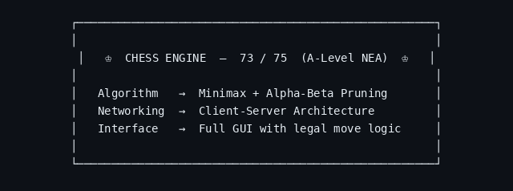

<!-- Chess Profile README for ConnConn24 -->

<div align="center">


[](https://git.io/typing-svg)

</div>

---
## About Me

```python
class Connor:
    def __init__(self):
        self.name        = "Connor"
        self.age         = 20
        self.university  = "University of York — Computer Science (Year 1)"
        self.startup     = "Social Hub  (Co-Founder & Director)"
        self.languages   = ["Python", "Java", "JavaScript", "TypeScript"]
        self.stack       = ["Next.js", "Firebase", "React"]
        self.music       = "Grade 8 Guitar · Grade 5 Piano"

    def current_move(self):
        return [
            "Scaling Social Hub",
            "Securing a first",
        ]
```

---

## Featured Project — Chess AI

<div align="center">



[](https://github.com/ConnConn24)

</div>

---

## Social Hub

> **The operating system for university societies.**  
> One platform for communications, events & membership payments. For students, by students.

```
  Co-Founder & Director
```

---

## Tech Stack

<div align="center">


</div>

---

## Stats

<div align="center">


[](https://git.io/streak-stats)

</div>

---

## Codewars

<div align="center">

[](https://www.codewars.com/users/Zombie242)

</div>

---
